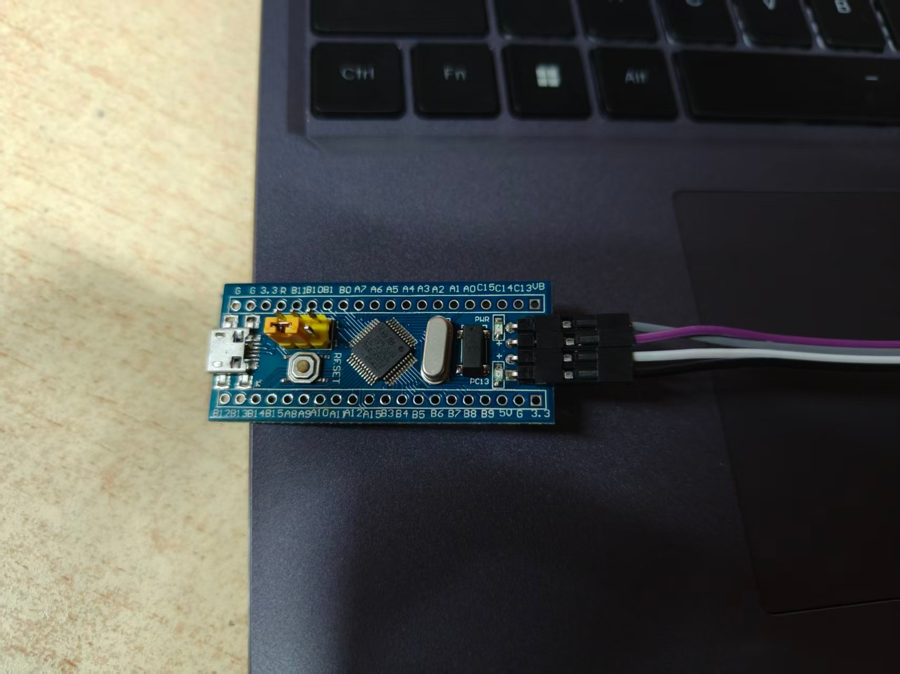

# 电控第一次作业 说明文档

**板子**：STM32F103C8T6（F103 最小系统板）

| 项目 | 内容 |
|---|---|
| 姓名 | ____________ |
| 学号 | ____________ |
| 仓库 | https://github.com/____________/F103_HomeWork |
| 完成日期 | 2026 年 10 月 ____ 日 |

---

## 一、GPIO

把 PC13 配成推挽输出，然后在上电初始化的时候把它置为低电平。F103 最小系统板的板载 LED 就是接在 PC13 上的，低电平点亮，所以置低以后灯就亮了。主循环按题目要求留空，不在里面翻转电平。

```cpp
/* Tasks/src/my_task.cpp */
void MyTaskInit(void)
{
  /* PC13 接板载 LED，低电平点亮 */
  HAL_GPIO_WritePin(GPIOC, GPIO_PIN_13, GPIO_PIN_RESET);

  HAL_TIM_Base_Start_IT(&htim2);
}
```

CubeMX 里 PC13 的配置：`GPIO_Output`、Output Push Pull、No pull-up/pull-down、Maximum output speed = Low、GPIO output level = Low、User Label = `LED_PC13`。

灯亮的照片在附录第一张。

---

## 二、定时器

用一个定时器的更新中断，周期 1 ms。中断里让 `tick` 加 1，并且喂一次狗。`tick` 定义成全局的 `volatile uint32_t`，这样在 Debug 下 Ozone 才能看到它实时的值。回调只写一份，放在 `Tasks` 里面。

```cpp
/* Tasks/src/my_task.cpp —— 回调要由 HAL 的 C 代码调用，C++ 里必须加 extern "C" */
volatile uint32_t tick = 0;

extern "C" void HAL_TIM_PeriodElapsedCallback(TIM_HandleTypeDef *htim)
{
  if (htim == &htim2)
  {
    tick++;
    HAL_IWDG_Refresh(&hiwdg);
  }
}
```

定时器时钟是这么来的：外部晶振 HSE 是 8 MHz，经过 PLL 九倍频之后 SYSCLK 是 72 MHz；APB1 的分频是 2，所以 APB1 总线是 36 MHz。APB1 的分频不是 1，这种情况下定时器的时钟是 APB1 的两倍，也就是 36 × 2 = 72 MHz，TIM2 挂在 APB1 上，所以它的时钟就是 72 MHz。

要让中断周期是 1 ms，先把计数时钟降到 1 MHz，再让计数器数 1000 个数溢出一次：

```
计数时钟 = 72 MHz / (PSC + 1) = 1 MHz
         => PSC + 1 = 72，所以 PSC = 71
中断周期 = (ARR + 1) / 计数时钟 = 1000 / 1 MHz = 0.001 s = 1 ms
         => ARR + 1 = 1000，所以 ARR = 999
```

所以 PSC = 71，ARR = 999。程序跑起来以后 `tick` 每秒增加 1000 次，附录第二张是 Ozone 里抓的截图。

中断链路：

```
TIM2 更新事件
  → TIM2_IRQHandler()            (Core/Src/stm32f1xx_it.c)
  → HAL_TIM_IRQHandler(&htim2)   (HAL 驱动)
  → HAL_TIM_PeriodElapsedCallback(&htim2)   (Tasks/src/my_task.cpp)
  → tick++ 且 HAL_IWDG_Refresh(&hiwdg)
```

> 截图注意：Timeline 里的 `Power` 和 `Code` 要关掉，程序必须处于运行状态。CPU 一停，看门狗仍在计数，调试器会掉线。
>
> 另：本机 Ozone 为 V3.26，不支持在 `.jdebug` 里用 `DataGraph.Add("tick")` 自动加曲线（会报脚本错误导致工程加载失败），因此要在 Ozone 界面里手工把 `tick` 加到 Data Graph / Timeline，采样率 1 kHz。

---

## 三、看门狗

IWDG 保持启用，超时和分频都不动，`tick` 还是每 1 ms 加 1。把回调里的 `HAL_IWDG_Refresh` 删掉重新编译下载，芯片就会在超时之后复位。

超时按手册给的 LSI 算，F103 大约是 40 kHz，分频取 64，Reload 取 1249：

```
超时 = (Reload + 1) × 分频 / LSI
     = (1249 + 1) × 64 / 40000
     = 2.0 s
```

复位以后启动代码会把全局变量清零，所以 `tick` 从 0 重新开始涨，涨到大约 2000 的时候看门狗超时，芯片复位，`tick` 又归零，就这样一直重复。超时大约 2 秒，比 1 ms 的中断周期长得多，所以 `tick` 有足够的时间涨上去。附录第三张能看到这个锯齿形状。

第 2 题 / 第 3 题的切换只改一个宏：

```cpp
/* Tasks/src/my_task.cpp */
#define FEED_WATCHDOG   1    /* 1 = 喂狗(第2题)，0 = 不喂狗(第3题) */
```

---

## 四、实测验证

用调试器直接读芯片寄存器和内存，确认各项配置与现象：

| 项目 | 期望 | 实测 |
|---|---|---|
| SYSCLK 源 | PLL | |
| HSE 就绪 / PLL 锁定 | 1 / 1 | |
| APB1 定时器时钟 | 72 MHz | |
| TIM2 PSC / ARR | 71 / 999 | |
| TIM2 计数 | 运行 | 运行 |
| IWDG 分频 / Reload | 64 / 1249 | |
| PC13 电平 | 0（点亮） | 0 |
| tick 增速（第 2 题） | 1000 次/秒 | |
| tick 峰值与周期（第 3 题） | 约 2000，约 2 s | |

---

## 五、工程与构建

```
F103_HomeWork/
├── Core/                  CubeMX 生成的初始化代码（main.c / gpio.c / tim.c / iwdg.c / stm32f1xx_it.c）
├── Drivers/               HAL 库 + CMSIS
├── Tasks/                 业务代码（不会被 CubeMX 冲掉）
│   ├── inc/my_task.hpp
│   └── src/my_task.cpp
├── cmake/                 工具链配置
├── docs/                  附录图片
├── CMakeLists.txt         发放的模板，user_folders = "Tasks"
├── F103_HomeWork.ioc      CubeMX 工程
├── F103_HomeWork.jdebug   Ozone 工程
├── README.md / 附录.md
└── build/F103_HomeWork.elf   构建产物，Ozone 打开它
```

构建：VS Code 选 Debug 按 F7，或命令行

```
cmake --preset Debug
cmake --build --preset Debug
```

> CubeMX 每次重新生成后要检查 `CMakeLists.txt` 是否还是发放的模板，被盖掉就换回来；`Tasks/` 和 `USER CODE` 段不会被冲掉。

---

## 六、遇到的问题与解决过程

1. **`tick` 每秒只增加 100 多**：一开始 RCC 只开了 HSI、PLL 关闭，系统时钟是 8 MHz，而 PSC=71/ARR=999 是按 72 MHz 算的，实际周期变成 9 ms。把 RCC 的 HSE 改成 `Crystal/Ceramic Resonator`、PLL×9 配到 72 MHz 后恢复正常。
2. **`g_pfnVectors` 重复定义**：发放模板用 `file(GLOB_RECURSE startup_file "*.s")` 递归收集启动文件，工程目录里放着带 `startup_*.s` 的备份目录就会被一起编进来。把备份目录移出工程后解决。
3. **`TIM2_IRQHandler` 重复定义**：CubeMX 启用 TIM2 中断后会生成一份 `TIM2_IRQHandler`，自己再手写一份就重复。统一走 CubeMX 生成的那份。
4. **Ozone 一暂停就复位**：CPU 停在断点时看门狗照常计数，2 秒后复位、调试器掉线。观察 `tick` 时全程保持运行。
5. **调试器连不上目标（`cannot read IDR`）**：接线反复插拔后 DAPLink 出现 `CMSIS-DAP command failed`、虚拟盘报错甚至从 USB 消失。底层排查显示探针侧正常（`DAP_Connect` 成功、SWD 引脚电平被目标上拉为高），但目标对 SWD 请求返回全 0。重新插紧 SWD 四根线（`3V3`/`GND`/`SWDIO`/`SWCLK`）后恢复。
6. **板子没有 USB 口**：供电只能来自调试器的 `3V3` 引脚，所以 `3V3` 和 `GND` 两根线必须接触可靠，否则芯片欠压复位，表现为"电源灯亮但调试器连不上"。

---

## 七、附录

> 按作业要求，正文不放图，所有截图和照片统一放在这里。

**图 1　第 1 题：PC13 板载灯点亮**



图注：STM32F103C8T6 最小系统板，PC13 输出低电平，板载灯点亮。

**图 2　第 2 题：`tick` 的 Ozone 监视 / Timeline 截图（每秒约 +1000）**

（在此插入截图：Ozone 运行状态下的 `Watched Data` 或 `Timeline`，程序处于运行中，不停在断点上）

图注：TIM2 更新中断周期 1 ms，`tick` 每秒增加约 1000。

**图 3　第 3 题：`tick` 的 Ozone Timeline 截图（涨到约 2000 再归零）**

（在此插入截图：能看出 `tick` 上升、归零、再上升的循环）

图注：回调里不再喂狗，IWDG 约 2 秒超时复位芯片，复位后全局变量被清零，因此 `tick` 在 0 与约 2000 之间循环。

---

## 八、提交清单

- [ ] 附录三张图齐备（照片在灯亮时拍；截图时程序不停在断点上）
- [ ] 填写姓名、学号、完成日期
- [ ] 填写仓库链接，仓库设为 **Public** 并 push
- [ ] 邮件主题：`姓名_学号_电控第1次作业`
- [ ] 收件人 `13567781025@163.com`，抄送 `2077822372@qq.com`
- [ ] 截止：2026 年 10 月 6 日 22:00
